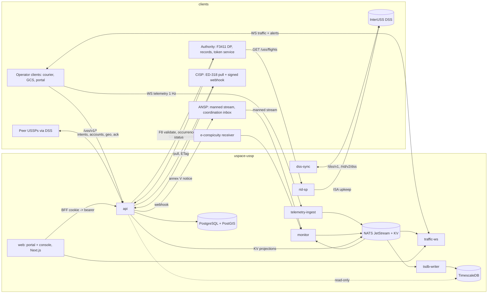

# uspace-ussp implementation plan

Status: plan for implementation by independent agents, one work package
per pull request. Branch `plan/initial`. Inputs: the spec at
`uspace-lab/docs/spec/` (`00 §6.1`, `§6.2`, `§7`; `01 §3`; `02 F3`–`F8`,
`F13`, `§3 ussp`; `03 §3`, `§6`; `04`; `05`; `06`; `07` S-M1..S-M5; `09`),
the knowledge base at `uspace-lab/knowledge/` (`LESSONS.md`, the vector
files that name `ussp` as an owner, `scenarios.md` SC-01, 02, 03, 08, 09,
14, 15, 16, 17, 21, 22), the shared Go module `rootxkit/uspace-core`
(its `docs/PLAN.md` is the template for this one; `v1.0.0` is the first
tag this repo pins), and the predecessor `rootxkit/utm` (Wave U tasks
U-05, U-06, U-07, U-08, U-10, U-11, U-17 as a record of behaviour, never of
architecture).

Sections: 1 scope and role boundary; 2 decisions; 3 architecture;
4 package layout; 5 data model and migrations; 6 the published API;
7 events on the bus; 8 security; 9 performance budgets; 10 testing;
11 deployment; 12 milestones; 13 work packages, waves and the critical
path; 14 engineering standards and CI; 15 open questions with proposed
answers.

---

## 1. Scope and role boundary

`uspace-ussp` is the reference U-space Service Provider of 2021/664
Art. 7–13 and 15 (spec `01 §3`). It is one of possibly many: third
parties may write their own USSP, so everything that crosses its
boundary is a standard (ASTM F3411-22a, ASTM F3548-21, EUROCAE ED-318)
or a published national OpenAPI 3.1 contract (`00 §7`). The repo holds
one Go module (`github.com/rootxkit/uspace-ussp`), its OpenAPI file, its
two migration trees, and the operator portal and USSP console under
`web/`.

### What it does (the obligations of `01 §3`)

| # | Service | Where in this plan |
|---|---|---|
| S1 | Network identification: ingest operator telemetry at 1 Hz, serve it as an F3411 Net-RID Service Provider (ISA per flight in the DSS, `GET /uss/flights`, `/details`) to the authority and peers | §4 `telemetry`, `ridsp`; WP-8, WP-9 |
| S2 | Geo-awareness: the operational conditions, constraints, geo-zones and temporary restrictions of the CIS, with `updated_at`, `version`, `valid_from/to` | §4 `cis`, `geo`; WP-4, WP-12 |
| S3 | Flight authorisation: Annex IV intake, registry validity, zone and restriction checks, strategic deconfliction (local and via the DSS), priority, deviation thresholds, authorisation number, activation, re-check against new restrictions | §4 `intent`, `dss`; WP-7, WP-13 |
| S4 | Traffic information: manned (ANSP feed, own e-conspicuity receiver) and unmanned (peers via F3411, own flights) traffic to the operator with trust class, age and a CPA proximity alert (national addition) | §4 `traffic`, `peers`, `manned`; WP-11, WP-14 |
| S5 | Conformance monitoring: each flight against its authorised volumes, thresholds and the Art. 6(1) conditions; alerts to the operator, nearby operators, peers (F3548 `Nonconforming`) and the ANSP (Annex V notice, acknowledged) | §4 `conformance`; WP-10 |
| S6 | Weather (optional): Art. 12 minimum content from a configured source | §4 `weather`; WP-16 |
| S7, S9 | Records ≥ 30 days, occurrence reports within 72 h, start / cease notices, peer data purged at 24 h | §4 `records`, `occurrence`; WP-15 |
| S8 | Registry validity through the authority's F8 API, cached, never PII | §4 `registry`; WP-5 |
| S10 | The F3411 SP and F3548 USS interfaces within the standards' response times | §6.2; WP-9, WP-13 |
| S11 | The console's emergency workflow | WP-18 |

### What it does NOT do

- **Command an aircraft.** No process has a socket, credential or
  protocol towards a vehicle; alerts and decisions go to the operator's
  client, the portal and the console (spec `00 §1`, LESSONS INV-01).
- **Resolve conflicts.** It informs; the remote pilot decides (Art. 11(4),
  LESSONS X-15, C-11). No "lower id holds" advice, ever.
- **Hold the registry.** Operator, UAS and pilot truth is the authority's;
  the USSP holds validity answers (status only) and its own customer
  record (`06 §1`). No names, addresses, phones or emails from the registry.
- **Author zones or restrictions.** It reads the CIS; it never publishes
  to it.
- **Detect violations.** The 120 m open-category rule outside U-space
  airspace and zone incursions as violations are the authority's
  (`09 §2`). The USSP's height judgement is conformance against the
  authorised upper limit, which the airspace constraints already cap.
- **Require an authorisation** for flights outside 2021/664's scope
  (A1 with C0 or privately built < 250 g; Art. 1(3)). It may accept them
  voluntarily and always serves them network identification and traffic
  information if they connect.
- **Assume the CISP, the DSS, a peer USSP or the authority is ours.** The
  CISP of record, the DSS and the token service are deployment
  configuration; peers are discovered through the DSS; the authority
  polls us as any F3411 Display Provider would (`00 §7`).
- **Keep peer data** longer than 24 h outside its own decision records
  (F3548 `ExternalDataMaxRetentionTimeHours`, F3411 `NetDpMaxDataRetentionPeriodSeconds`).
- **Re-implement a judgement `uspace-core` provides.** Identification,
  zone judgement, CPA, the alert lifecycle, time placement, pressure
  altitude, geodesy, ED-318 parsing, F3411/F3548 validation and JWT
  verification are imported from core and never copied (`06` T12).

---

## 2. Decisions

| # | Decision | Why |
|---|---|---|
| D1 | Seven processes under `cmd/` exactly as spec `00 §6.1` lists them: `api`, `telemetry-ingest`, `rid-sp`, `monitor`, `traffic-ws`, `dss-sync`, `tsdb-writer`. One image, one entrypoint per process. A `cmd/ussp-dev` binary runs all seven in one process for local work and never ships in the image. | Failure isolation the spec names (`05 §6`: `rid-sp` down must not stop `monitor`; `api` down must not stop any live service) and independent scaling of `monitor` per cell. One module keeps every judgement a package call. |
| D2 | `uspace-core` is pinned by tag, `v1.0.0` at WP-0, bumped only by its own `build(deps)` commit. Nothing in this repo re-implements identification, zone judgement, CPA, alert lifecycle, time placement, geodesy, ED-318, F3411/F3548 validation or JWT verification. Two judgements core does not provide, **conformance** (track against authorised volumes, thresholds and Art. 6(1)) and **strategic deconfliction** (Volume4D intersection in space, time and altitude, with priority), are USSP-only in the regulation (`01 §7`: R, A = ussp) and are built here in `internal/conformance` and `internal/intent/deconflict`, pinned by JSON vectors in the lab's shape under `testdata/vectors/`, and proposed to `uspace-lab/knowledge/vectors/` and to core as additive `v1.x` packages once the lab's SITL scenarios have run them (§15 Q1). | `00 §6` says safety logic exists once; once is satisfied by one owner. The authority and the lab consume the *results* (F3548 states, records), never the judgement. |
| D3 | The standard interfaces are generated, never hand-written: the pinned `uas_standards` OpenAPI files of F3411 v22a and F3548 v21 (the same commits and SHA-256 that `uspace-core/f3411/SOURCE` and `f3548/SOURCE` record) generate the USS-side **server** interfaces and the DSS-side **clients** with oapi-codegen v2 into `internal/stdapi/`; handlers convert at the boundary and validate with core's `UnmarshalRIDFlight`, `UnmarshalOperationalIntent`, `Altitude.HAEM`, `Volume4DToZonesEnvelope`. The generated code is committed and CI verifies it offline (`scripts/check-generated.sh`: regenerate from the vendored YAML, diff). | LESSONS E-03 generalised: a field name on the wire comes from the standard's file. Core deliberately generated types only (its D5: a library has no HTTP client); the servers and clients are a system concern. The duplicated struct definitions are generated from one source and never edited (§15 Q5). |
| D4 | The national API is spec-first: `api/openapi.yaml` (OpenAPI 3.1) is the published contract (`00 §7`), and `oapi-codegen` generates the `net/http` server interface (`std-http-server`, Go 1.22 routing) and the Go client (used by the lab and by tests) from it. An endpoint that is not in the file does not exist. | Owner's stack; `02 §1` publication rule; `uspace-lab/api/` aggregates the file. |
| D5 | Two migration trees with goose, embedded: `migrations/relational/` (PostgreSQL 16 + PostGIS 3.4, written only by `api`) and `migrations/timeseries/` (TimescaleDB, written only by `tsdb-writer`; `api` reads it for records). Separate version tables `goose_db_version_relational` and `goose_db_version_timeseries`. Never merged. | LESSONS B-15; spec `03` preamble. The spec names `golang-migrate`; the owner's stack says goose (§15 Q3). |
| D6 | Hot-path processes never open PostgreSQL. What they need is projected by `api` into NATS KV buckets (`cis_current`, `policy`, `source_control`, `registry_validity`, `client_bindings`, `intent_active`) and read as in-memory projections refreshed by watch plus periodic re-read; a stale projection is served with its age, never blocks. | Spec `00 §6.2`, `05 §2`; LESSONS G-08, B-08, B-09. |
| D7 | The partition key is a pure-Go geodesic grid (`internal/cell`): `cell5` ≈ 8 km squares and `cell3` their 16×16 parents, named `c3:<row>:<col>` / `c5:<row>:<col>`, behind an interface whose only consumers are subject names and consumer ownership maps. H3 resolution 5 (the spec's figure) is not used because the maintained Go binding is cgo and core rejected it (core PLAN §11 gap 3). The cell never appears on an external interface. | `05 §3` calls the key "a design choice"; a cgo dependency in seven binaries buys nothing at 100–1000 drones. §15 Q2. |
| D8 | JSON everywhere, with the message schemas of `04` that this repo **produces** under `schemas/`: `telemetry/v1`, `alert/v1`, `intent/request/v1`, `intent/decision/v1`, `intent/state/v1`, `track/telemetry/v1` (internal), `coordination/annex_v/v1`, `traffic/product/v1` (new, §6.1). Consumed schemas (`cis/change/v1`, `manned_track.v1`, `occurrence/v1`) are read from the producing repo's published copy in `uspace-lab/schemas/` at a pinned commit, never redefined here. | `04 §1` schema ownership rule. §15 Q9 on the two schemas whose producer is ambiguous. |
| D9 | Operator machine clients authenticate with OAuth2 client credentials at the USSP's own issuer (`core/auth.Issuer`, RS256, JWKS at `/.well-known/jwks.json`); portal users with local accounts (argon2id) and a BFF session cookie. A full OIDC provider for operators is deferred: the claims shape is OIDC's so it can be added without changing clients (§15 Q4). Peers, the authority and the ANSP present ecosystem tokens verified by `core/auth.Verifier` with the authority's issuer allow-listed. | `01 §3` users table, `06 §3`. |
| D10 | Thresholds are a versioned `policy` row (`policy_version` travels on every alert and decision): CPA minima, deviation threshold defaults, `telemetry_lost_s`, `lost_link_s`, `cis_stale_s`, `proximity_radius_m`, `nonconformance_nearby_radius_m`, `escalation_repeat_s`, retention days. Never a literal. | LESSONS INV-03, S-13 policy reload; `04 §3.3`. |
| D11 | Trust and source class travel on every track; a source that fails is `stale`/`unavailable`/`source_disabled` with age, never removed. Source control (type and instance switches) uses `core/sources` with the KV + push pattern. | `02 §1` failure rule, LESSONS B-11, B-16. |
| D12 | The optional national extension `WS /v1/authority/flights` is built (WP-9) but **off by default** and never a condition of any milestone: the F3411 DP path is the conformance baseline. | `02 F7`, `09 §2`. |

---

## 3. Architecture



### 3.1 Processes

| Process | Serves | Reads | Writes | Must keep working when |
|---|---|---|---|---|
| `api` (control plane, stateless behind Caddy) | `/v1/intents/*`, `/v1/geo/*`, `/v1/alerts/{id}/ack`, `/v1/registry/validate`, `/v1/records/*`, `/v1/weather/*`, `/v1/accounts/*`, `/oauth/*`, `/.well-known/jwks.json`, the F3548 USS endpoints `/uss/v1/*`, the CIS webhook receiver `/v1/cis/notify`, `/v1/admin/*` (policy, sources), `/healthz`, `/metrics` | PostgreSQL; TimescaleDB read-only (records); CIS (F3); authority (F8, F7) | PostgreSQL (sole writer); KV projections; JetStream `intent.v1`, `cis.v1`, `ctl.*`; outbox to the DSS handed to `dss-sync` | NATS or TimescaleDB down: refuses what needs them with a 503 that names the dependency, keeps serving reads |
| `telemetry-ingest` | `WS /v1/telemetry`, `POST /v1/telemetry/batch` | KV `client_bindings`, `source_control`, `policy`; geoid grid | `trk.v1.*` (core NATS + mirror), `ingest.v1.<cell3>` on backpressure, `src.v1.*` | `api` down (bindings from KV with age); DSS down; CIS down |
| `rid-sp` | `GET /uss/flights`, `GET /uss/flights/{id}/details`, `POST /uss/identification_service_areas/{id}` (ISA notifications for our own peer views), optional `WS /v1/authority/flights` | `trk.v1.>` (own flights), KV `intent_active`, `registry_validity` | ISA create/update/delete in the DSS (F3411); `peers.isa_notify` to `dss-sync`'s view registry | DSS down (serves `/uss/flights` from its in-memory 60 s window; ISA upkeep retried) |
| `monitor` (partitioned per `cell3`; one instance for the demo) | nothing over HTTP but `/healthz`, `/metrics` | `trk.v1.<cell3>.>` plus ring-1 neighbours, `man.v1.<cell3>.>`, KV `intent_active`, `cis_current`, `policy`, `source_control`; terrain and geoid | `alrt.v1.*` (raise, refresh, clear), `conf.v1.*` (conformance states), `ident.v1.*` | `api` down (projections with age); CIS down (last zones with `cis_age_s`); terrain absent (height not evaluated, said so) |
| `traffic-ws` | `WS /v1/traffic`, `GET /v1/traffic/snapshot`, `WS /v1/alerts` (stream) | `trk.v1`, `man.v1`, `alrt.v1`, KV `policy` | `traffic.product.v1` samples (0.1 Hz per client) for the record | everything but NATS |
| `dss-sync` | nothing over HTTP | JetStream `intent.v1.*` outbox, `conf.v1.*`, peer notifications queued by `api` | DSS `/dss/v1/*` (operational intent references, subscriptions, constraint queries), peer USS `POST /uss/v1/operational_intents` notifications, `peer_intents` via `api`'s internal endpoint, `ctl.dss_state` | DSS down: queues with backoff, marks `pending_dss`, reports |
| `tsdb-writer` | nothing | `trk.v1` mirror, `man.v1`, `peer.v1`, `traffic.product.v1`, `conf.v1` | TimescaleDB (sole writer), batched `COPY`, bounded 10 s queue, spill to the JetStream mirror | TimescaleDB down: queue, then spill, counted |

The console's live feed is `traffic-ws` with a staff session (it is the
same stream with a `bbox` instead of an `intent_id`).

### 3.2 Boundaries (spec `00 §6.2`)

| Boundary | Mechanism | Rule here |
|---|---|---|
| hot path → control plane (alerts needing records, conformance states, flight start/end, identification changes) | JetStream subjects with explicit ack; `api` persists and opens workflow (escalation, Annex V notice, DSS state change via `dss-sync`) | `api` never re-judges; the judgement came from the package `monitor` imported |
| control plane → hot path (policy, zones, registry validity, bindings, switches, active intents) | NATS KV buckets written by `api` inside the same transaction's commit hook (B-09: refuse the write with 503 when the store cannot take it), watched by the hot path, re-read every 300 s | a hot-path process starts without a bucket after 3 retries with every source enabled and logs that the state is unknown (SC-08 step 8) |
| synchronous judgement in `api` (deconfliction, zone checks on an intent) | direct calls into `internal/intent`, `internal/cis` (which calls `core/zones`), `internal/registry` | the DSS write is the only remote call in the request path and it is after the local decision |
| `web` → backend | HTTPS same origin; the BFF route exchanges login for an `HttpOnly`, `SameSite=Strict` cookie and forwards the bearer | `web` has no database, no NATS, no geometry library (lint rule) |
| TypeScript types | `openapi-typescript` from `api/openapi.yaml` and `json-schema-to-typescript` from `schemas/` | a hand-written API type fails lint |

---

## 4. Package layout

```
github.com/rootxkit/uspace-ussp
├── cmd/
│   ├── api/  telemetry-ingest/  rid-sp/  monitor/  traffic-ws/  dss-sync/  tsdb-writer/
│   └── ussp-dev/              all seven in one process; dev only, not in the image
├── api/
│   ├── openapi.yaml           the national USSP API (OpenAPI 3.1); published; aggregated by uspace-lab
│   └── standards/             pinned copies of uas_standards' F3411 v22a and F3548 v21 OpenAPI (SOURCE + sha256)
├── schemas/                   JSON Schemas this repo produces (04 §1): telemetry, alert, intent/*, track/telemetry, coordination, traffic/product
├── migrations/
│   ├── relational/            goose, embedded, PostgreSQL + PostGIS (api is the only writer)
│   └── timeseries/            goose, embedded, TimescaleDB (tsdb-writer is the only writer)
├── internal/
│   ├── config/                env → typed config; every value documented in deploy/ENV.md
│   ├── obs/                   slog JSON, Prometheus registry, OpenTelemetry setup, health
│   ├── httpx/                 server base: timeouts, body caps (1 MiB), request id, problem+json errors, scope middleware
│   ├── auth/                  core/auth wiring: own issuer (operators), ecosystem verifier (peers, authority, ANSP), scopes, sessions, client-serial bindings
│   ├── accounts/              operator accounts, OAuth2 clients, staff accounts, roles
│   ├── store/                 pgx pools, sqlc-generated queries (relational, timeseries), transactions, outbox
│   ├── bus/                   NATS JetStream streams, subjects (05 §3), KV buckets, projections, followers
│   ├── cell/                  partition key (D7); cell sets per viewport and per intent
│   ├── policy/                the policy row, versioning, KV projection, defaults
│   ├── sources/               core/sources follower + the admin switch writer (B-09)
│   ├── cis/                   F3 client (pull, ETag, versions), webhook receiver (JWS), reconciliation, cache tables, cis_current projection, applicability evaluation via core/ed318 + core/zones
│   ├── registry/              F8 client, validity cache (24 h / 5 min), change feed, registry_validity projection, identification via core/identify
│   ├── intent/                Annex IV validation, Volume4D → AMSL, local states, authorisation number, deviation thresholds, decision records, Art. 1(3) exemption, standing re-check (Art. 10(10))
│   │   └── deconflict/        space-time-altitude intersection, priority, FCFS; JSON vectors (D2)
│   ├── dss/                   F3548 and F3411 DSS clients (generated under stdapi), ovn/key handling, subscriptions, outbox worker, peer notifications, uss_availability, peer_intents (24 h)
│   ├── stdapi/                generated: f3411 USS server + DSS client, f3548 USS server + DSS client (D3)
│   ├── telemetry/             WS and batch ingest, rate limit, serial binding, time placement (core/timeplace), AMSL (core/geoid), flight sessions, telemetry_lost
│   ├── flights/               flight records, ISA lifecycle facts, flight ↔ intent binding
│   ├── ridsp/                 F3411 SP: 60 s window per flight, recent_positions, view caps, details, ISA upkeep, ISA notification receiver, the optional authority push
│   ├── conformance/           judgement (D2): track vs volumes, thresholds, time window, Art. 6(1), lost link, Nonconforming → Contingent; state machine with hysteresis; JSON vectors
│   ├── traffic/               CPA via core/alerting.Monitor, neighbour inputs (own, peer, manned, broadcast), the traffic product, degraded flags, proximity alerts
│   ├── geo/                   geo-awareness responses from the CIS cache; zone incursion and restriction_activated alerts (core/alerting zones path)
│   ├── alerts/                alert records, acknowledgement, escalation (10 s repeat, supervisor), nonconformance_nearby fan-out
│   ├── peers/                 DP role towards peer USSPs: ISA discovery via DSS, `GET /uss/flights` polling per view, 24 h cache, peer_unavailable
│   ├── manned/                ANSP F4 stream client (mTLS), e-conspicuity adapter (ADS-B JSON/SBS), `man.v1`, trust classes, stale and unavailable
│   ├── coordination/          F13: Annex V notices to the ANSP, acknowledgement records, retry
│   ├── records/               Art. 15(1)(g): per-flight record, daily bundles, retention jobs, 24 h purges, traffic product sampling
│   ├── occurrence/            occurrence/v1 to the authority, 72 h deadline, delivery status
│   ├── status/                start / cease / restart notices (Art. 7(6))
│   ├── weather/               Art. 12 products from a configured source adapter
│   ├── admin/                 staff console endpoints: flights, alerts, DSS state, degraded inputs, emergency workflow, switches
│   └── national/              generated server interface and client from api/openapi.yaml, plus handlers' glue
├── web/                       Next.js: operator portal (public) and USSP console (staff); uspace-ui kit; ka/en
├── deploy/
│   ├── Dockerfile  compose/  caddy/  ENV.md  conformance/ (uss_qualifier configs against the lab DSS)
├── testdata/vectors/          conformance and deconfliction vectors (lab shape), proposed upstream
├── scripts/                   check-generated.sh, check-schemas.sh, migrate.sh, seed-dev.sh
└── docs/                      this plan, WORKPACKAGES/, RUNBOOKS/
```

Dependency rules: `internal/*` packages import `uspace-core` freely and
each other only downward in this order: `config, obs, httpx, cell, policy`
← `store, bus, auth` ← `cis, registry, sources, accounts` ← `intent, flights,
telemetry` ← `conformance, traffic, geo, alerts, ridsp, dss, peers, manned`
← `coordination, records, occurrence, status, weather, admin, national`.
No package imports a `cmd/`. `web/` imports nothing from Go: it consumes
generated types only. A cycle is a build failure (`scripts/check-deps.sh`
runs `go list -deps` against this order).

---

## 5. Data model and migrations

Conventions (spec `03` preamble): units in column names (`alt_amsl_m`,
`speed_ms`, `timeout_s`); AMSL and AGL never in one column or one
calculation; `TIMESTAMPTZ` UTC; geometry `SRID 4326`, distance on
`geography`; no stored AGL. `api` is the only writer of the relational
database; `tsdb-writer` the only writer of the hypertables; `api` reads
TimescaleDB read-only for records and exports.

### 5.1 Relational (`migrations/relational/`, PostgreSQL 16 + PostGIS 3.4)

| Table | Key columns | Notes |
|---|---|---|
| `operator_accounts` O | `id`, `authority_registration_number`, `display_name`, `contact_email`, `status`, `validated_at`, `validation_status`, `created_at` | The USSP's customer record; registry truth stays at the authority. |
| `oauth_clients` O | `client_id`, `operator_id`, `secret_hash` (argon2id), `scopes[]`, `status`, `created_at`, `rotated_at` | Scopes `ussp.intents`, `ussp.telemetry`, `ussp.traffic`, `ussp.geo`. Creation notifies the operator (T3). |
| `client_serial_bindings` O | `client_id`, `serial`, `serial_fold` (core/serial.FoldKey), `bound_at`, `unbound_at` | A client may send telemetry only for its bound serials (06 T3). Projected to KV `client_bindings`. |
| `staff_accounts` O | `id`, `username`, `password_hash`, `role` (`supervisor`, `support`, `admin`), `mfa_secret_ref`, `status` | Console users. |
| `operational_intents` O | `id` (UUID = DSS entity id), `operator_id`, `client_id`, `uas_serial`, `pilot_ref`, `priority`, `dss_state` (F3548 four), `local_state` (`pending_validation`, `pending_dss`, `pending_authority`, `accepted`, `activated`, `nonconforming`, `contingent`, `ended`, `rejected`, `withdrawn`), `volumes` (JSONB, F3548 `Volume4D[]` verbatim), `off_nominal_volumes`, `volumes_amsl` (JSONB: per volume `lower_amsl_m`, `upper_amsl_m`, `undulation_m`), `envelope_geom` (geography, union of outlines), `time_start`, `time_end`, Annex IV block (`mode`, `flight_type`, `category`, `class_label`, `type_certificate`, `identification_technology`, `connectivity_methods[]`, `endurance_s`, `loss_of_c2_procedure`, `operator_reg`, `ua_registration`), `contingency` (JSONB), `emergency_contact_ref`, `authorisation_ref`, `client_ref` (idempotency, unique per client), `in_uspace_airspace`, `uspace_airspace_ids[]`, `exempt_art_1_3` bool, `dss_ovn`, `dss_version`, `decision`, `authorisation_number`, `deviation_thresholds` (JSONB `{h_m, v_m, t_s}`), `alternative` (JSONB), `conflicts` (JSONB), `conditions[]`, `cis_version_checked`, `registry_checked_at`, `weather_checked_ref`, `policy_version`, `created_at`, `updated_at` | One row per intent; `intent_versions` keeps every prior version (what was decided on which inputs). |
| `intent_versions` O | `intent_id`, `version`, `at`, `actor`, `change_reason`, `snapshot` (JSONB) | Art. 6(6), 10(10) changes are versions with a reason. |
| `flights` O | `id`, `intent_id` (nullable: a telemetry session without an intent outside U-space airspace), `authorisation_number`, `uas_serial`, `operator_reg`, `client_id`, `started_at`, `ended_at`, `end_reason` (`landed`, `telemetry_lost`, `intent_ended`, `operator_ended`), `rid_flight_id`, `isa_id`, `isa_version`, `emergency`, `last_state` | One flight per activated intent or per session. |
| `conformance_states` O | `flight_id`, `at`, `state` (`conforming`, `nonconforming`, `contingent`, `lost_link`, `unknown`), `reason`, `distance_outside_m`, `height_over_m`, `time_outside_s`, `policy_version`, `peer_notified_at`, `ats_notified_at`, `ats_ack_ref`, `nearby_notified` (JSONB) | Append-only timeline. |
| `alerts` O | `id`, `kind`, `flight_id`, `intent_id`, `authorisation_number`, `peer_ref`, `severity`, `state`, `raised_at`, `updated_at`, `cleared_at`, `clear_reason`, `detail` (JSONB), `captured_at`, `policy_version`, `acked_at`, `acked_by`, `escalated_at`, `delivery` (JSONB per client) | Kinds of `04 §3.3`. |
| `dss_isas` O | `isa_id`, `flight_id`, `version`, `time_start`, `time_end`, `extents` (JSONB), `created_at`, `deleted_at`, `last_error` | F3411 ISA per flight. |
| `dss_subscriptions` O | `subscription_id`, `kind` (`rid`, `utm`), `area` (JSONB), `version`, `notification_index`, `time_end`, `uss_base_url`, `renewed_at` | ≤ 10 per area, ≤ 24 h, renewed. |
| `dss_outbox` O | `id`, `kind` (`oir_put`, `oir_delete`, `isa_put`, `isa_delete`, `peer_notify`, `uss_report`), `entity_id`, `payload`, `attempts`, `next_at`, `done_at`, `last_error` | What `dss-sync` works through (idempotent by `entity_id` + version). |
| `dss_state` O | singleton: `uss_availability`, `set_by`, `set_at`, `dss_reachable_since`, `dss_unreachable_since` | Shown on the console. |
| `peer_intents` P | `entity_id`, `manager`, `uss_base_url`, `state`, `ovn`, `version`, `time_start`, `time_end`, `details` (JSONB), `fetched_at`, `peer_unavailable` | Purged at 24 h (`ExternalDataMaxRetentionTimeHours`) except what a decision record copied. |
| `constraints` P | `entity_id`, `manager`, `ovn`, `version`, `time_start`, `time_end`, `details` (JSONB), `cis_restriction_id` (join to the CIS restriction when the ANSP reference matches), `fetched_at` | F3548 constraint intake. |
| `cis_datasets` P | `dataset`, `version`, `etag`, `fetched_at`, `metadata` (JSONB), `signature_ok` | `cis_version` and `cis_age_s` come from here. |
| `cis_features` P | `dataset`, `version`, `feature_id`, `feature` (JSONB verbatim ED-318), `geom`, `lower_m`, `lower_ref`, `upper_m`, `upper_ref`, `applicable_from`, `applicable_to`, `zone_type` | Only the current and the previous version are kept; history is the CISP's. |
| `cis_notifications` P | `id`, `received_at`, `dataset`, `version`, `feature_ids[]`, `reason`, `jws_ok`, `pulled_at` | The webhook log. |
| `registry_validity` P | `entity_type`, `key`, `status`, `valid_until`, `class_label`, `mtom_band`, `competencies` (JSONB), `fetched_at`, `negative` bool | TTL 24 h positive, 5 min negative; invalidated by the F8 change feed. No PII. |
| `occurrence_reports` O | `id`, `report_ref`, `kind`, `occurred_at`, `became_aware_at`, `deadline_at` (= became_aware_at + 72 h), `payload` (JSONB `occurrence/v1`), `submitted_at`, `authority_ref`, `attempts`, `last_error` | Undelivered ones are on the console. |
| `operating_status_notices` O | `id`, `kind` (`start`, `cease`, `restart`), `at`, `submitted_at`, `authority_ref` | Art. 7(6). |
| `weather_products` O | `id`, `area` (geography), `observed_at`, `valid_from`, `valid_to`, `source`, `product` (JSONB, Art. 12(2) fields), `fetched_at` | Optional. |
| `policy` O | `version`, `created_at`, `actor`, `reason`, `values` (JSONB) | Versioned; `policy_version` travels. |
| `source_controls` O | `source_type`, `instance_id`, `enabled`, `reason`, `actor`, `changed_at`, `version` (sequence), `epoch` | B-09 model. |
| `record_bundles` O | `date`, `built_at`, `content_hash`, `storage_ref`, `flights` | Daily bundles for `GET /v1/records/daily/{date}`. |
| `events` O | `id`, `ts`, `actor_type`, `actor_id`, `purpose`, `entity_type`, `entity_id`, `event_type`, `payload` | Append-only audit, partitioned by month; no `UPDATE`/`DELETE` grant for the application role. |

### 5.2 Time series (`migrations/timeseries/`, TimescaleDB)

| Hypertable | Columns | Chunk / compression / retention |
|---|---|---|
| `telemetry` O | `flight_id`, `captured_at`, `ts`, `rx_ts`, `backlog`, `time_source`, `geom`, `alt_wgs84_m`, `alt_amsl_m`, `undulation_m`, `alt_pressure_m`, `height_m`, `height_ref`, `speed_ms`, `track_deg`, `vspeed_ms`, `status`, `emergency`, `operator_position` (geometry, nullable), `accuracy_h`, `accuracy_v`, `timestamp_accuracy_s`, `source_client_id`, `cell5` | 1-day chunks; `compress_segmentby flight_id`, `orderby captured_at`; compressed after 7 days; retained 90 days online (policy; floor 30 days, Art. 15(1)(g)); `operator_position` nulled after 90 days unless an incident references the flight |
| `peer_flights` P | `peer_uss`, `rid_flight_id`, `rx_ts`, `state` (JSONB `RIDAircraftState`), `details` (JSONB), `isa_id`, `cell5` | retention **24 h**, enforced by a Timescale retention policy and verified by a test |
| `manned_tracks` P | `icao24`, `callsign`, `captured_at`, `ts`, `rx_ts`, `geom`, `alt_pressure_m`, `alt_wgs84_m`, `gs_ms`, `track_deg`, `vrate_ms`, `emergency`, `source_class`, `quality`, `adapter_id`, `trust`, `cell5` | 7 days hot, 90 days compressed |
| `econspicuity_tracks` P | as `manned_tracks` with `trust = broadcast`, `receiver_id` | same |
| `broadcast_tracks` P | optional own RID receivers (deferred; table created, no writer until a receiver exists) | same |
| `traffic_products` O | `client_id`, `at`, `intent_id`, `bbox`, `tracks_shown` (JSONB: ids, trust, age), `degraded[]`, `policy_version` | sampled 0.1 Hz; 90 days |
| `conformance_samples` O | `flight_id`, `captured_at`, `state`, `distance_outside_m`, `height_over_m` | per-sample judgement outcome for records; 90 days |

### 5.3 Migration rules

- Every schema change is a goose migration in the right tree; never a
  hand edit. Both trees embed (`embed.FS`) and run at process start of
  their owner (`api` for relational, `tsdb-writer` for timeseries) with an
  advisory lock; other processes wait for the version they need and
  refuse to start on a lower one, printing which.
- `sqlc` generates the query layer per tree (`internal/store/relational`,
  `internal/store/timeseries`); generated code is committed and checked
  offline in CI.
- CI runs both trees up, down, up against real PostgreSQL+PostGIS and
  TimescaleDB containers (`timescale/timescaledb-ha` carries PostGIS).

---

## 6. The published API

One origin, `https://<ussp host>`, Caddy routing path groups to processes
(`02 §3`). Every national endpoint below is in `api/openapi.yaml`;
every standard endpoint is defined by `uas_standards` and served by the
generated interface (D3). Errors are RFC 9457 `application/problem+json`
with a stable `type` slug and, for refusals of a judgement, the
`conflicts[]` or the field path.

### 6.1 National API (`api/openapi.yaml`, tag per group)

| Endpoint | Process | Scope / role | Spec | Notes |
|---|---|---|---|---|
| `POST /v1/intents` | api | `ussp.intents` | `02 F5`, `04 §3.5`, Art. 6(4), 10 | body `intent/request/v1` (the ten Annex IV items + contingency + emergency contact ref); returns `intent/decision/v1`; `client_ref` idempotent |
| `GET /v1/intents/{id}` | api | `ussp.intents` (own) | `02 F5` | decision, state, conflicts, versions |
| `GET /v1/intents?from=&to=&state=` | api | `ussp.intents` (own) | `02 F5` | list |
| `PATCH /v1/intents/{id}` | api | `ussp.intents` | Art. 6(5), 10(5), 6(7) | `{action: activate | modify | end, volumes?}`; activation confirmed in the response without unjustified delay; modify = new version re-decided |
| `GET /v1/geo?bbox=&at=` and `GET /v1/geo/intents/{id}` | api | `ussp.geo` | `02 F5`, Art. 9 | applicable zones, airspaces with Art. 3(4) requirements, restrictions; each with `updated_at`, `version`, `valid_from/to`; `cis_version`, `cis_age_s`, `stale` |
| `WS /v1/telemetry` | telemetry-ingest | `ussp.telemetry` | `02 F5`, Art. 8(2) | frames `telemetry/v1`; server `status` frames (accepted, dropped, rate, `backlog` ack); 2 Hz per client cap |
| `POST /v1/telemetry/batch` | telemetry-ingest | `ussp.telemetry` | `02 F5` | ≤ 1 s batches; `backlog=true` on drain; acked only when queued durably (B-05) |
| `WS /v1/traffic?intent_id=` or `?bbox=` | traffic-ws | `ussp.traffic` / staff | `02 F5`, Art. 11 | `traffic/product/v1` at 1 Hz: tracks with position, time of report, speed, heading, emergency, `trust`, `age_s`; `degraded[]`; proximity alerts inline |
| `GET /v1/traffic/snapshot?intent_id=|bbox=` | traffic-ws | `ussp.traffic` / staff | `02 F5` | bootstrap |
| `WS /v1/alerts?intent_id=` | traffic-ws | `ussp.traffic` | `02 F5`, Art. 13 | `alert/v1` push; repeats unacknowledged critical alerts every `escalation_repeat_s` |
| `POST /v1/alerts/{id}/ack` | api | `ussp.traffic` | `02 F5` | records `acked_at/by` |
| `GET /v1/registry/validate?operator=&serial=&pilot=` | api | `ussp.intents` | `02 F5`, `F8` | proxy with cache; status only |
| `GET /v1/weather?bbox=&at=` | api | `ussp.geo` | Art. 12 | optional; `503 weather_unavailable` with reason when no source |
| `GET /v1/records/flights/{id}` | api | `ussp.records` (authority) | `02 F7`, Art. 15(1)(g), 18(b) | authorisation (number, thresholds, decision, conflicts), telemetry summary, alerts, conformance timeline, traffic shown; no names |
| `GET /v1/records/daily/{date}` | api | `ussp.records` | `02 F7` | bundle with content hash |
| `WS /v1/authority/flights` | rid-sp | `rid.display_provider` (authority) | `02 F7` optional national extension | off unless `USSP_AUTHORITY_PUSH=on`; never a milestone condition (D12) |
| `POST /v1/cis/notify` | api | CISP's JWS (JWKS allow-listed) | `02 F3` | `cis/change/v1` webhook; pulls the delta; logs |
| `POST /oauth/token` | api | client credentials | `06 §3` | USSP issuer for operator clients; `aud` = this USSP's id, TTL ≤ 1 h |
| `GET /.well-known/jwks.json` | api | public | `06 §3` | issuer keys |
| `POST /v1/accounts/login`, `/logout`, `GET /v1/accounts/me` | api | portal / console sessions | `01 §3` | argon2id; session JWT for the BFF cookie; MFA for staff admin |
| `POST /v1/accounts/operators` (self-registration with registration number), `GET/PATCH /v1/accounts/operators/{id}`, `POST /v1/accounts/operators/{id}/clients`, `POST .../clients/{id}/serials`, `DELETE .../serials/{serial}`, `POST .../clients/{id}/rotate` | api | `operator_admin` | `01 §3`, `06 T3` | validity checked through F8 before activation |
| `GET /v1/admin/flights`, `/alerts`, `/dss`, `/inputs`, `/escalations`; `POST /v1/admin/alerts/{id}/escalate|close`; `POST /v1/admin/emergency/{flight_id}` (open, note, close) | api | `supervisor`, `support` | `01` S11, `05 §6` | console; degraded inputs with age |
| `GET/PUT /v1/admin/policy`, `GET/POST /v1/admin/sources` | api | `admin` | INV-03, U-15 | audited; 503 when the KV cannot take the switch (B-09) |
| `GET /healthz`, `GET /readyz`, `GET /metrics` | every process | none / network | — | `readyz` lists each dependency with state and age |

### 6.2 Standard interfaces (served from the generated interfaces)

| Endpoint | Process | Scope | Standard | Budget |
|---|---|---|---|---|
| `GET /uss/flights?view=&recent_positions_duration=` | rid-sp | `rid.display_provider` | F3411-22a SP | view diagonal ≤ 7 km else 413; p95 ≤ 1 s, p99 ≤ 3 s; positions ≤ 60 s old plus `recent_positions` |
| `GET /uss/flights/{id}/details` | rid-sp | `rid.display_provider` | F3411-22a SP | details for views ≤ 2 km; `uas_id`, `operator_id` (registration number), `operator_location`, `eu_classification` |
| `POST /uss/identification_service_areas/{id}` | rid-sp | `rid.service_provider` (DSS) | F3411-22a | ISA change notifications for our DP-role subscriptions (peers) |
| `GET /uss/v1/operational_intents/{entityid}` | api | `utm.strategic_coordination` | F3548-21 | answered ≤ 1 s (`MaxRespondToOIDetailsRequestSeconds`) |
| `GET /uss/v1/operational_intents/{entityid}/telemetry` | api | `utm.conformance_monitoring_sa` | F3548-21 | last position of a Nonconforming/Contingent intent |
| `POST /uss/v1/operational_intents` | api → dss-sync | `utm.strategic_coordination` | F3548-21 | peer notifications in; stored as `peer_intents` |
| `GET /uss/v1/constraints/{entityid}` | api | `utm.constraint_processing` | F3548-21 | we manage no constraints; 404 with problem |
| `POST /uss/v1/constraints` | api → dss-sync | `utm.constraint_processing` | F3548-21 | constraint notifications in (ANSP restrictions) |
| `POST /uss/v1/reports` | api | any utm scope | F3548-21 | stored, counted |
| `GET /uss/v1/log_sets/{log_set_id}` | api | `utm.strategic_coordination` | F3548-21 | `USSLogSet` from the DSS exchange log |

DSS calls we make (clients generated from the same files): F3548
`PUT/GET/DELETE /dss/v1/operational_intent_references/{entityid}[/{ovn}]`,
`POST /dss/v1/operational_intent_references/query`,
`POST /dss/v1/constraint_references/query`, `GET /dss/v1/constraint_references/{entityid}`,
`PUT/DELETE /dss/v1/subscriptions/{id}`, `GET /dss/v1/uss_availability/{uss_id}`;
F3411 `PUT/DELETE /rid/v2/dss/identification_service_areas/{id}[/{version}]`,
`GET /rid/v2/dss/identification_service_areas?area=`,
`PUT/DELETE /rid/v2/dss/subscriptions/{id}[/{version}]`. Peer USS calls:
`GET {uss_base_url}/uss/v1/operational_intents/{entityid}`,
`POST {uss_base_url}/uss/v1/operational_intents`,
`GET {uss_base_url}/uss/flights?view=`, `.../details`. Every outgoing
call carries an ecosystem token with the scope the standard names and
`aud` as the deployment configures for the DSS and for peers.

### 6.3 Outbound national calls (clients generated from the owning repo's OpenAPI, pinned from `uspace-lab/api/`)

| Call | Target | Scope | Spec |
|---|---|---|---|
| `GET /v1/registry/validate`, `POST /v1/registry/validate`, `GET /v1/registry/changes?since=` | authority | `registry.validate` | `02 F8` |
| `POST /v1/occurrences` | authority | `occurrences.write` | `02 F7` |
| `POST /v1/certificates/{id}/status` | authority | `certificates.status` | `02 F7`, Art. 7(6) |
| `GET /v1/{dataset}?bbox=&at=&since_version=`, `GET /v1/{dataset}/versions/{v}`, `GET /v1/changes?since=`, `POST /v1/subscriptions` | CISP | `cis.read` | `02 F3` |
| `WS /v1/manned-traffic/stream?bbox=`, `GET /v1/manned-traffic/snapshot` | ANSP | `ansp.traffic` + mTLS | `02 F4` |
| `POST /v1/coordination/*` (`coordination/annex_v/v1`) | ANSP | ecosystem token | `02 F13` |

Until those repos publish their files, the clients are built against
the endpoint shapes in `02` and marked `// CONTRACT: pending <repo> openapi`
with a CI check that lists them; the aggregation in `uspace-lab/api/`
replaces them (§15 Q8).

---

## 7. Events on the bus

One NATS cluster for this system on its own network; per-process
credentials; no JWT inside (`00 §6.2`). Subjects follow `05 §3`; the
cell is D7's.

| Subject | Stream | Producer → consumer | Payload |
|---|---|---|---|
| `trk.v1.<cell3>.<cell5>.<track_id>` | core + JetStream mirror `TRK` (1 h) | telemetry-ingest, peers, manned → monitor, traffic-ws, rid-sp, tsdb-writer | `track/telemetry/v1` with `trust`, `source`, `identification`, `flight_id`, `intent_id` |
| `man.v1.<cell3>.<cell5>.<icao24>` | core | manned → monitor, traffic-ws, tsdb-writer | `track/manned/v1` |
| `alrt.v1.<kind>.<cell5>.<alert_id>` | JetStream `ALRT` (7 d) | monitor → api (record), traffic-ws (push); republished every 1 s while active (C-08) | `alert/v1` |
| `conf.v1.<flight_id>` | JetStream `CONF` (30 d) | monitor → api (state record, DSS state change, Annex V notice, nearby fan-out), tsdb-writer | conformance state change |
| `ident.v1.<track_id>` | JetStream `IDENT` (24 h) | telemetry-ingest, peers → api, console | identification change |
| `intent.v1.<state>.<intent_id>` | JetStream `INTENT` (30 d) | api → dss-sync (outbox trigger), monitor (via KV `intent_active`), console | `intent/state/v1` |
| `cis.v1.<dataset>` | JetStream `CIS` (30 d) + KV `cis_current` | api → monitor, traffic-ws, geo | version, feature ids, reason |
| `peer.v1.<cell3>.<cell5>.<rid_flight_id>` | core | peers → traffic-ws, monitor, tsdb-writer | peer flights as `track/telemetry/v1` with `trust: provider` |
| `traffic.product.v1.<client_id>` | JetStream `TRAFFIC` (1 d) | traffic-ws → tsdb-writer | sampled products for the record |
| `ingest.v1.<cell3>` | JetStream work queue (10 min) | telemetry-ingest → telemetry-ingest (drain) | raw telemetry under backpressure; oldest dropped with a counted gap, never the newest |
| `src.v1.<type>.<instance>` | core | every adapter every 2 s → api, console | `source/status/v1` |
| `ctl.sources`, `ctl.policy`, `ctl.dss_state` | core (push) + KV | api → everyone | version + epoch |

KV buckets (written by `api` only): `cis_current` (dataset → version +
feature set as `zone/applicable/v1` per cell), `policy` (the row),
`source_control` (B-09 state), `registry_validity` (key → status, TTL),
`client_bindings` (client → serials), `intent_active` (intent id → volumes
AMSL, thresholds, flight id, cell set, state). Every follower logs the
projection age in its status line and refuses nothing when the bucket is
missing (everything enabled, identification `registry_unavailable`,
zones "none loaded, said so": SC-22).

---

## 8. Security

Threats of `06 §2` that land here: T3 (operator credential compromise),
T4 (inter-system impersonation), T5 (token service outage), T6 (PII), T8
(DoS on ingest), T9 (malicious peer or CISP), T10 (public repo), T11
(simulator in production), T12 (safety logic duplication).

| Control | Where |
|---|---|
| Ecosystem tokens verified by `core/auth.Verifier`: RS256 only, `kid`, allow-listed `iss` (the authority's token service), `aud` = this USSP's system id, 30 s skew, scope per endpoint (`httpx` middleware). JWKS fetched at start; outage keeps the cache (T5). | `internal/auth`, `internal/httpx` |
| Operator machine tokens issued by `core/auth.Issuer` (own RSA key from KMS/env file, 90-day rotation runbook, `kid` rotation with both keys in the JWKS during the overlap). TTL ≤ 1 h. Client secrets argon2id. | `internal/auth`, `internal/accounts` |
| A client sends telemetry only for its bound serials; a second live session for one serial is refused and counted; a teleport > 100 m/s between samples is flagged `anomaly: teleport` on the track and counted, never silently dropped (T3). | `internal/telemetry` |
| Body caps 1 MiB; `GET /uss/flights` view diagonal cap and flight-count cap; peer responses bounded (`MaxMessageBytes` of core); per-client WS rate 2 Hz; per-client and per-IP limits in Caddy and in `httpx` (T8, T9). | `internal/httpx`, `deploy/caddy` |
| ED-318 from the CISP validated by `core/ed318.Parse` and refused, never repaired; the webhook JWS verified against the CISP's JWKS; the 60 s reconciliation pull is mandatory (T9). | `internal/cis` |
| PII minimum: the USSP stores registration numbers, serials, the emergency contact as a *reference* resolvable only by the authority, and the remote pilot / take-off position for the flight (Art. 8(2)(e)); the F3411 `operator_location` is served to authorised DPs only; records to the authority carry no names (`06 §5`). | `internal/records`, `internal/ridsp` |
| Production ingest refuses `trust: simulated` and `source: sitl` at the schema validator; the lab's simulated operator uses an ordinary client credential and is `authenticated` like any operator (T11). | `internal/telemetry` |
| Audit: every write, token issuance and refusal, source switch, policy change, PII-bearing record export is an `events` row with actor and purpose; role `ussp_app` has no `UPDATE`/`DELETE` on `events`, `telemetry`, `conformance_states` (T7). | `migrations/relational`, `internal/store` |
| Public repo: gitleaks in CI and pre-commit; `.env.example` only; fixtures use `GEO-TEST-*` numbers and `TEST*` serials; a CI grep for `chikox.net` outside `deploy/staging/` fails; SBOM and cosign on images; `SECURITY.md`. | `.github/workflows`, `deploy/` |
| `web/`: no credential in browser code, BFF cookie `HttpOnly`/`SameSite=Strict`, CSRF token, no geometry import (ESLint rule), no DB/NATS client. | `web/` |

---

## 9. Performance budgets (from spec `05`)

Design point: 100 concurrent drones on the staging droplet today (2 vCPU,
3.8 GB), 1000 in a few years on dedicated hosts. Every number is a
budget checked by the lab's load test (L-M2), reported in CI benchmarks,
never gated there.

| Quantity | 100 drones | 1000 drones | Budget / mechanism |
|---|---|---|---|
| Operator telemetry in | 100 msg/s, 60 KB/s | 1000 msg/s, 600 KB/s | one `telemetry-ingest` instance to 2000 msg/s on one core: decode + place + bind ≤ 200 µs per message |
| Internal fan-out (`trk.v1` × monitor, traffic-ws, rid-sp, tsdb-writer) | 400 msg/s | 4000 msg/s | core NATS; mirror stream 1 h |
| CPA pair checks | < 1000/s | ≈ 50 000/s | `core/alerting.Monitor` per cell set; ≤ 50 000 pairs/s per worker; above budget the worker widens its tick to 2 s for that cell and reports `evaluation_period_s` (never skips) |
| Conformance judgements | 100/s | 1000/s | ≤ 50 µs per sample (polygon containment with bbox prefilter + vertical + time) |
| Authority DP polls on `/uss/flights` | 10 views, 100 flights/s | 50 views, 1000 flights/s | served from the in-memory 60 s window, no database on the path; p95 ≤ 1 s, p99 ≤ 3 s |
| Peer DP polls we make | 10/s | 50/s | one in-flight request per view; a slow SP polled at 0.5 Hz with age shown |
| Intent operations | 250/day | 2500/day | `POST /v1/intents` p95 ≤ 500 ms without the DSS; the DSS write adds its RTT; deconfliction over ≤ 1000 active local + peer intents via the envelope index |
| F3548 timing | — | — | peer notification ≤ 5 s; conflicting-intent notification ≤ 1 s; details response ≤ 1 s; constraint notification handling ≤ 5 s |
| Alert latency | — | — | proximity / nonconformance p99 < 2 s after the triggering sample's `captured_at`; zone alert within one tick; Annex V notice within 5 s |
| Console / operator WS out | 2000 msg/s | 6000 msg/s | per-viewport throttle to 2 Hz per track above 200 tracks; `dropped_frames` visible |
| Storage | 5 GB/day raw, 0.4 GB compressed | 52 GB/day, 4–5 GB | 1-day chunks, compression after 7 days, writer queue < 10 s |
| Restart | — | — | picture recovers within 10 s; no duplicate alerts (alert keys deterministic, raise state replayed from `ALRT`); no lost backlog |

Benchmarks named in `docs/bench-targets.txt` (WP-0 creates it): `BenchmarkTelemetryDecodePlace`,
`BenchmarkConformanceJudge`, `BenchmarkDeconflictEnvelope`, `BenchmarkFlightsView`,
`BenchmarkTrafficProduct`.

---

## 10. Testing strategy

Rules (CLAUDE.md): E-01 presence and absence pairs; E-02 run the branch
that says nothing is wrong; E-03 no wire format from memory (generated
from the pinned files, vectors from the lab); E-04 report what ran;
E-10 every bound exceeded by a test; INV-02 an alert path is done when
SITL or a lab scenario raised and cleared it.

| Layer | What | Where / how |
|---|---|---|
| Unit | every package; table tests; fuzz targets on every decoder that reads untrusted bytes (`telemetry/v1`, `intent/request/v1`, CIS webhook, ANSP frames, ADS-B adapter) | `go test -race -shuffle=on ./...` |
| Core vectors, owned cases | `RunOwned(t, "ussp", ...)` on `identification_status`, `serials_and_registration`, `fleet_match`, `cpa`, `alert_lifecycle`, `zones_vertical`, `zones_applicability`, `geodesy`, `terrain_geoid`, `source_control`, `jwt_verify`, `ed318_roundtrip`, `rid_time` (network cases), `pressure_altitude` — run against **this repo's adapters** (the mapping from our wire types onto core inputs), never a second copy of the judgement | `internal/<pkg>/vectors_test.go`; the core module's own vector tests also run from the module cache in CI (`go test -run Vectors github.com/rootxkit/uspace-core/...`) |
| Repo vectors | `testdata/vectors/conformance.json`, `deconfliction.json` in the lab's file shape (description, units, tolerance, owners, cases with `why`); proposed upstream to `uspace-lab/knowledge/vectors/` | `internal/conformance`, `internal/intent/deconflict` |
| Schema examples | every `schemas/*` has examples under `schemas/examples/`; Go structs round-trip them; `openapi-typescript` output is up to date | `scripts/check-schemas.sh` |
| Integration (CI, real services) | PostgreSQL+PostGIS+TimescaleDB and NATS as GitHub Actions service containers; migrations up/down/up; `api` + `telemetry-ingest` + `monitor` + `traffic-ws` + `dss-sync` + `tsdb-writer` started in-process from `cmd/ussp-dev` against them; a fake DSS (`internal/dss/fakedss`, in-memory, the subset of the DSS API we call, with ovn semantics), a fake authority (F8 + JWKS + occurrences), a fake CISP (F3 with ETag + webhook), a fake ANSP (F4 stream + coordination inbox) under `internal/testfakes/`; each fake has a "down" switch for the degraded-path tests of `02` (CIS stale → `cis_stale`; DSS down → `pending_dss`; authority down → cached validity then `unknown`; ANSP down → `manned: unavailable since T`) | `make integration` (`go test -tags integration ./...`), job `integration` in CI |
| Conformance hooks | `deploy/conformance/`: compose profile with the InterUSS DSS (its published image, pinned by digest) and `uss_qualifier` configurations for F3411 SP (v22a) and F3548 (strategic coordination, constraint processing) pointed at this USSP; `make conformance` runs them locally; the lab (`uspace-lab/conformance/`) runs the same against staging and owns the pass criteria and the national OpenAPI contract tests | WP-19; CI runs it on a manual dispatch and on release tags only (it pulls external images) |
| Scenarios (lab, SITL) | SC-01, SC-02, SC-21 (CPA), SC-03 (zone), SC-08 (source switches), SC-09 (no false spoof on drain), SC-14 (drain ≥ 5× intake), SC-15 (stalled adapter), SC-16 (peer SP switched off), SC-17 (registry change reaches resolvers), SC-22 (missing inputs are visible), plus the S-M2/S-M3/S-M4 done-when runs of `07` (conformance in and out of the volume, `nonconformance_nearby`, ANSP acknowledgement, peer `Nonconforming`, lost link, restriction activation, peer purge at 24 h) | run by `uspace-lab` against this repo's image; each WP that owns an alert path lists the scenario it must pass and records the run (date, image digest, numbers) in `docs/RUNBOOKS/<wp>.md` |
| Load | the `05 §7` table at 100 and 1000 drones from the lab's generators; this repo exposes the counters the report needs (`dropped_*`, `gap_*`, `degraded_*`, `evaluation_period_s`, writer queue depth) on `/metrics` | lab L-M2 |
| Web | ESLint + Prettier + `tsc --noEmit` strict; Playwright smoke (login, file an intent, see the decision, see traffic) against `cmd/ussp-dev` with the fakes; `ka` and `en` catalogues complete (a missing key fails) | `web/` CI job |

Coverage targets: ≥ 85 % statement coverage on `internal/conformance`,
`internal/intent`, `internal/telemetry`, `internal/ridsp`, `internal/dss`,
`internal/traffic`, `internal/cis` (the safety- and contract-relevant
packages); best effort elsewhere, with every branch that produces a
distinct counter, reason or problem+json `type` covered by a named test.

---

## 11. Deployment

- One image `ghcr.io/rootxkit/uspace-ussp:<sha>` (multi-stage, distroless,
  non-root, `CGO_ENABLED=0`), entrypoint `/usr/bin/ussp-<process>`; one
  image `ghcr.io/rootxkit/uspace-ussp-web:<sha>` built in CI (`next build`,
  standalone output). Never build Next.js on the server.
- `deploy/compose/docker-compose.yml`: the seven processes, `web`,
  `postgres` (postgis image), `timescaledb` (`timescale/timescaledb-ha`,
  PostGIS included), `nats` (JetStream on, per-process accounts), on an
  isolated network; only Caddy (shared, in the infra repo) is outside.
  Profiles: `demo` (adds the InterUSS DSS and the lab fakes), `conformance`.
- Caddy snippet `deploy/caddy/ussp.caddy`: `uspace-ussp.chikox.net` →
  path groups per process; rate limits; the hostname is a variable.
- Config by env only, every variable documented in `deploy/ENV.md` with
  default, unit and the process that reads it: `USSP_SYSTEM_ID`,
  `USSP_USS_BASE_URL`, `USSP_DSS_BASE_URL`, `USSP_DSS_AUDIENCE`,
  `USSP_CISP_BASE_URL`, `USSP_AUTHORITY_BASE_URL`, `USSP_TOKEN_ISSUER`,
  `USSP_TOKEN_JWKS_URL`, `USSP_ANSP_STREAM_URL`, `USSP_ANSP_MTLS_*`,
  `USSP_ISSUER_KEY_FILE`, `USSP_PG_URL`, `USSP_TS_URL`, `USSP_NATS_URL`,
  `USSP_NATS_CREDS`, `USSP_GEOID_FILE`, `USSP_TERRAIN_DIR`,
  `USSP_CELL_OWNERSHIP`, `USSP_AUTHORITY_PUSH`, `USSP_WEATHER_SOURCE`,
  `USSP_ADSB_SOURCE`. No hostname in code.
- Staging: the droplet's compose project `uspace-ussp`; images pulled by
  digest from GHCR by the owner's deploy (never by CI); migrations run by
  `api` and `tsdb-writer` at start; backups: nightly `pg_dump` of the
  relational database and Timescale chunk export to the backup account
  (runbook in WP-20). Production is per operator: a third-party USSP
  deploys its own; the state deploys none of this repo.

---

## 12. Milestones (spec `07` phase 4, plus the scaffold)

| Milestone | Done when (verbatim from `07` where it has one) |
|---|---|
| S-M0 Scaffold | `go build ./...`, lint, `make integration` green against real Postgres/Timescale/NATS; the OpenAPI skeleton generates server and client; both migration trees run up/down/up; the image builds; `cmd/ussp-dev` serves `/healthz` and `/readyz` naming every dependency with state |
| **S-M1 Intents and geo-awareness** (first demo) | an operator client files an intent with all ten Annex IV items; it is checked against the CIS cache (zones, restrictions, airspace constraints) and existing intents; two overlapping intents filed in either order give the same decision; a special-operation intent (SERA Art. 4) wins priority, equal priority is first come first served; a refusal names the conflicting item; an acceptance carries an authorisation number and deviation thresholds; activation is confirmed; registry validity fetched from the authority and cached; a C0 A1 flight is accepted without authorisation (Art. 1(3)) |
| S-M2 Telemetry, network ID, conformance | SITL aircraft stream telemetry over the operator WS; an ISA is created in the lab DSS and `/uss/flights` serves them (F3411 v22a, p99 ≤ 3 s); the authority's DP view shows them; conformance raises and clears on a SITL aircraft leaving its volume or its deviation thresholds, including height above the authorised upper; nearby operators get `nonconformance_nearby`, the lab ANSP acknowledges the notice, the peer sees `Nonconforming`; lost link after the configured silence |
| S-M3 Traffic information | CPA proximity alerts between two SITL aircraft and between a SITL aircraft and a lab manned track; a lab ADS-B e-conspicuity source feeds traffic information directly; traffic WS by intent and bbox with trust class and age; stale and unavailable sources flagged |
| S-M4 DSS and peers | InterUSS DSS in the lab; intents written as F3548 references with ovn; a second lab USSP's intent conflicts are detected and notified within 1 s; `pending_dss` behaviour when the DSS is down; peer flights via F3411 as `provider`; a lab constraint from the ANSP triggers `restriction_activated` and an authorisation update; peer data purged at 24 h |
| S-M5 Records and occurrences | per-flight records (≥ 30 days) fetched by the authority; an airprox occurrence posted within 72 h of awareness; start / cease notices; USSP console (flights, alerts, DSS state, degraded inputs, emergency workflow) |
| S-M6 Conformance suite and staging | `uss_qualifier` F3411 SP and F3548 configurations pass against the lab DSS; the degraded behaviours of `02` observed with each dependency down; deployed on the staging droplet behind Caddy |

---

## 13. Work packages, waves and the critical path

Each WP has a brief in `docs/WORKPACKAGES/WP-<k>.md`, complete on its
own: branch `feat/WP-<k>-<slug>`, commit suffix `[WP-<k> S-M<n>]`, what
it owns exclusively, what it depends on, what to read first, what to
build, done-when, safety notes. A WP is sized for one agent and one PR;
a brief that grows past that is split as `WP-<k>a`/`b` with a plan
update in the same PR.

| WP | Slug | Owns (exclusively) | Depends on | Milestone |
|---|---|---|---|---|
| WP-0 | `scaffold` | `go.mod`, `cmd/*` skeletons, `internal/config`, `obs`, `httpx`, `api/openapi.yaml` skeleton, `scripts/`, `Makefile`, `.golangci.yml`, CI, `deploy/Dockerfile`, compose, `SECURITY.md`, `docs/bench-targets.txt`, `web/` bootstrap | — | S-M0 |
| WP-1 | `store-migrations` | `migrations/*`, `internal/store`, `internal/policy`, `events` audit, `internal/sources` (writer side) | WP-0 | S-M0 |
| WP-2 | `auth-accounts` | `internal/auth`, `internal/accounts`, `/oauth/*`, `/.well-known/jwks.json`, `/v1/accounts/*`, scope middleware, client-serial bindings, KV `client_bindings` | WP-1 | S-M1 |
| WP-3 | `standards-codegen` | `api/standards/`, `internal/stdapi/`, `scripts/check-generated.sh`, 501 stubs wired in `api` and `rid-sp` | WP-0 | S-M2 |
| WP-4 | `cis-cache` | `internal/cis`, `/v1/cis/notify`, KV `cis_current`, `zone/applicable` evaluation | WP-1 | S-M1 |
| WP-5 | `registry-validity` | `internal/registry`, `/v1/registry/validate`, KV `registry_validity` | WP-1 | S-M1 |
| WP-6 | `bus-cell-tsdb` | `internal/bus`, `internal/cell`, `cmd/tsdb-writer`, stream and KV definitions, followers | WP-1 | S-M0 |
| WP-7 | `intent-authorisation` | `internal/intent` (+ `deconflict`), `/v1/intents/*`, `intent.v1`, KV `intent_active`, `testdata/vectors/deconfliction.json` | WP-2, WP-4, WP-5, WP-6 | **S-M1** |
| WP-8 | `telemetry-ingest` | `internal/telemetry`, `internal/flights`, `cmd/telemetry-ingest`, `WS /v1/telemetry`, batch, `trk.v1`, `ingest.v1`, `src.v1`, `telemetry/v1` schema | WP-2, WP-6 | S-M2 |
| WP-9 | `rid-sp` | `internal/ridsp`, `cmd/rid-sp`, `/uss/flights*`, ISA upkeep, ISA notification receiver, optional `/v1/authority/flights` | WP-3, WP-8 | S-M2 |
| WP-10 | `conformance` | `internal/conformance`, `cmd/monitor` (conformance path), `conf.v1`, `conformance_states`, `nonconformance` and `lost_link` alerts, `nonconformance_nearby` fan-out, `testdata/vectors/conformance.json` | WP-7, WP-8 | **S-M2** |
| WP-11 | `traffic-cpa` | `internal/traffic`, `internal/alerts`, `cmd/traffic-ws`, `monitor`'s CPA path, `/v1/traffic*`, `/v1/alerts*`, `alert/v1` and `traffic/product/v1` schemas, escalation | WP-8, WP-6 | S-M3 |
| WP-12 | `geo-awareness` | `internal/geo`, `/v1/geo*`, zone incursion and `restriction_activated` alerts, Art. 10(10) standing re-check (calls `intent`) | WP-4, WP-7, WP-11 (alert records) | S-M1 (geo), S-M4 (restriction) |
| WP-13 | `dss-sync` | `internal/dss`, `cmd/dss-sync`, the F3548 USS endpoints, outbox, subscriptions, peer notifications, `pending_dss`, `peer_intents`, constraints intake, `uss_availability`, 24 h purge | WP-3, WP-7 | **S-M4** |
| WP-14 | `peers-manned` | `internal/peers`, `internal/manned`, `man.v1`, `peer.v1`, ANSP F4 client, e-conspicuity adapter, peer DP polling, `peer_unavailable`, `manned: unavailable` | WP-3, WP-6, WP-11 | S-M3 (manned), S-M4 (peers) |
| WP-15 | `coordination-records-occurrences` | `internal/coordination`, `internal/records`, `internal/occurrence`, `internal/status`, `/v1/records/*`, retention and purge jobs, `coordination/annex_v/v1` schema | WP-10, WP-11, WP-1 | S-M2 (Annex V), S-M5 |
| WP-16 | `weather` | `internal/weather`, `/v1/weather`, `weather_checked_ref` | WP-7 | after S-M5 (optional) |
| WP-17 | `web-portal` | `web/` operator portal: register, clients, intents, decisions, geo map, traffic, alerts | WP-0 (bootstrap), WP-7, WP-11, WP-12; can start against the OpenAPI mock after WP-7's PR is open | S-M1 (intents), S-M3 (traffic) |
| WP-18 | `web-console` | `web/` staff console: flights, alerts, DSS state, degraded inputs, escalations, emergency workflow, sources, policy | WP-17 (shared shell), WP-13, WP-15, `internal/admin` | S-M5 |
| WP-19 | `conformance-suite-hardening` | `deploy/conformance/`, `make conformance`, findings fixed in their packages (small, named PRs), chaos runs of `05 §6` recorded | WP-9, WP-13, WP-14 | S-M6 |
| WP-20 | `deploy-staging` | `deploy/compose`, `deploy/caddy`, `deploy/ENV.md`, GHCR publish job, backup and rollback runbooks | WP-0; refreshed after WP-8, WP-13 | S-M1 (first deploy), S-M6 |

Waves:

```
wave 0 (1 agent):              WP-0
wave 1 (after WP-0, 5 agents): WP-1   WP-3   WP-20   (WP-6 and WP-2 start the day WP-1's PR is open)
wave 2 (after WP-1):           WP-2   WP-4   WP-5   WP-6
wave 3 (after WP-2/4/5/6):     WP-7   WP-8                      -> S-M1 with WP-12(geo) + WP-17(intents pages)
wave 4 (after WP-7, WP-8):     WP-9   WP-10   WP-11   WP-12     -> S-M2, S-M3 (with WP-14 manned)
wave 5 (after WP-3, WP-7, 11): WP-13   WP-14   WP-15   WP-16    -> S-M4, S-M5
wave 6:                        WP-17 (traffic pages)   WP-18
wave 7:                        WP-19   WP-20 (refresh)          -> S-M6
```

Critical path: **WP-0 → WP-1 → WP-6 → WP-8 → WP-10 → WP-13 → WP-19**
(scaffold, store, bus, telemetry, conformance, DSS, conformance suite).
WP-7 (intents) is the other long pole and gates S-M1; it starts as soon
as WP-4 and WP-5 have PRs open, against their signatures. WP-10 and WP-13
are the safety-relevant reviews: both change what a peer, the ANSP and
the operator see and both must pass a lab scenario before merge.

Cross-WP conflicts are avoided by exclusive ownership. Shared files:
`api/openapi.yaml` (each WP adds its tag's paths in one commit; conflicts
are path-level and trivial), `CHANGELOG.md` (one line per WP under
Unreleased), `docs/bench-targets.txt` (names pre-assigned).

---

## 14. Engineering standards and CI

Go: `gofmt`, `go vet` (govet enable-all minus `fieldalignment`, `shadow`),
staticcheck v0.8.1 and golangci-lint v2.14.0 pinned as in core (the
`.golangci.yml` of core adapted: `forbidigo` allows `slog` and forbids
`fmt.Print*`, `log.*`, `panic` outside `cmd/*/main.go` and tests; `exhaustive`
on every enum; `gosec`; `errorlint`; `revive` exported docs). `go mod tidy`
clean. Generated code (`*.gen.go`, `internal/stdapi`, `internal/store/*/`)
exempt from style linters, never from vet, and verified unchanged by
`scripts/check-generated.sh`. No cgo. Dependencies need a one-line reason
in the commit body and a row in `docs/DEPENDENCIES.md` (WP-0 creates it
with: `uspace-core`, `pgx/v5`, `sqlc` (tool), `goose/v3`, `nats.go`,
`oapi-codegen/v2` (tool), `lestrrat-go/jwx/v3` (through core), `prometheus/client_golang`,
`go.opentelemetry.io/otel`, `coder/websocket` for WS, `golang.org/x/crypto/argon2`,
`google/uuid`).

CI (`.github/workflows/ci.yml`, written by WP-0): on push to `main`, tags
`v*`, and pull requests; `concurrency: ci-${{ github.ref }}` with
cancel-in-progress; every job `timeout-minutes` ≤ 20; `actions/setup-go`
cache; path filters so a `web/`-only change runs only the web job and a
`docs/`-only change runs nothing but a markdown link check. Jobs:

1. `build-vet-lint` (Go) — gofmt, build, vet, tidy, staticcheck, golangci-lint, `check-generated.sh`, `check-schemas.sh`, `check-deps.sh`, grep for hostnames.
2. `test-race` — `go test -race -count=1 -shuffle=on -coverprofile` for the module; core's vector tests from the module cache.
3. `integration` — service containers `timescale/timescaledb-ha:pg16` (PostGIS) and `nats:2-alpine`; `go test -tags integration`.
4. `web` — `npm ci`, lint, `tsc`, generated types up to date, `next build`, Playwright smoke against `cmd/ussp-dev` + fakes (only when `web/**` or `api/**` changed).
5. `image` — build both images on `main` and tags, push to GHCR with SBOM and cosign (on `pull_request` build only, no push).
6. `gitleaks`, `govulncheck` (pinned).
7. `conformance` — `workflow_dispatch` and tags only: the InterUSS DSS + `uss_qualifier` profile.

Branch protection on `main` requires 1–3 and 6. No scheduled jobs.

---

## 15. Open questions with proposed answers

Where the spec is silent or the owner's stack and the spec disagree.
Each row says what this plan assumes until answered.

| # | Question | Proposed answer (assumed) | Needs |
|---|---|---|---|
| Q1 | **Conformance and strategic deconfliction judgements are not in `uspace-core`** (`00 §6` lists "conformance, strategic deconfliction" as once-only safety logic; core v1.0.0 has `zones`, `cpa`, `alerting`, `f3548.Volume4DToZonesEnvelope` but no conformance or Volume4D-intersection package). | Build them in this repo (`internal/conformance`, `internal/intent/deconflict`) pinned by JSON vectors in the lab's shape; after S-M2/S-M4 scenarios have run, propose the vectors to `uspace-lab/knowledge/vectors/` and the packages to core as additive `v1.x` (`conformance`, `deconflict`). The USSP is the only regulatory owner (`01 §7`), so "once" holds either way. | Owner: accept, or ask core for the packages first (adds a core WP to the critical path). |
| Q2 | Partition key: `05 §3` says H3 resolution 5; the Go H3 binding is cgo and core rejected cgo. | D7: a pure-Go geodesic grid of the same scale behind `internal/cell`; never on an external interface. | Owner: accept or accept cgo in this repo. |
| Q3 | Migrations: spec `03` says `golang-migrate`; the owner's stack says goose. | goose, embedded, two trees (D5). | Owner confirms (spec text to be updated by the lab). |
| Q4 | Operator OIDC (`01 §3`: "OIDC accounts owned by the USSP"). A full OIDC provider (authorization code + PKCE, discovery, consent) is a sizeable WP. | D9: local accounts + BFF session cookie for the portal; OAuth2 client credentials for machines; OIDC claims shape; provider endpoints deferred to a later WP once an external relying party exists. | Owner. |
| Q5 | Generated F3411/F3548 server and client types duplicate core's generated types (same source files). | D3: accepted as generated-from-one-source; boundary conversion to core types in one place per direction (`internal/stdapi/convert`); core may later export server interfaces, at which point `stdapi` shrinks. | Owner; core maintainers. |
| Q6 | Deviation threshold defaults (Art. 10(2)(d)) and `lost_link_s`, `telemetry_lost_s`, nearby radius: national figures with no source. | Policy defaults: `h_m 50`, `v_m 15`, `t_s 60`, `telemetry_lost_s 5`, `lost_link_s 15` (spec `02 F5`), `nonconformance_nearby_radius_m 2000` (the traffic radius default), `proximity` as core's CPA policy (60 s / 60 m / 20 m / 800 m). Shown on the console as policy with version. | GCAA (spec Q17); owner for the demo figures. |
| Q7 | Authorisation number `<USSP code>-<operator public reg>-<ULID>` (`03 §6`): who assigns the USSP code? | The certificate id the authority issues (`certificates.id`), configured as `USSP_SYSTEM_ID`; `USSP-DEV` in the lab. | Authority planner / GCAA. |
| Q8 | The outbound national clients (F3, F4, F7, F8, F13) depend on OpenAPI files the sibling repos are writing now. | Clients built from the shapes in `02` with a `// CONTRACT: pending` marker and a CI list; replaced by generated clients from `uspace-lab/api/` when published; the fakes in `internal/testfakes` are the executable reading of `02` until then. | Sibling planners; lab aggregation. |
| Q9 | Schema ownership for `telemetry/v1` and `intent/request/v1` (produced by operators, defined by the USSP's API) and `occurrence/v1` (produced by the USSP, received by the authority). | The API owner publishes the request schema: this repo owns `telemetry/v1`, `intent/request/v1`, `intent/decision/v1`, `alert/v1`, `coordination/annex_v/v1`; the authority owns `occurrence/v1` and this repo consumes its published copy. | Lab (spec `04 §1` wording). |
| Q10 | ANSP coordination endpoint (`02 F13`: `POST /v1/coordination/*` returning `ack_id`) has no path or body detail. | `POST /v1/coordination/notices` with `coordination/annex_v/v1`, response `{ack_id, received_at}`; acknowledgement of a nonconformance notice by a person is a later `PATCH` on the ANSP side that we poll via `GET /v1/coordination/notices/{ack_id}` every 10 s until acknowledged or 5 min. | ANSP planner. |
| Q11 | e-conspicuity receiver (spec Q18): hardware and feed format. | `internal/manned` adapter reads a readsb/dump1090 `aircraft.json` endpoint or an SBS BaseStation TCP stream (both open formats); the lab replays a recorded file; ADS-L deferred. | Owner / GCAA. |
| Q12 | Weather source for Art. 12 (`U-08` had METAR + a forecast). | Adapter interface; first implementation METAR/TAF from a configured URL (NOAA AWC data API) for QNH, wind, visibility, temperature, dew point, cloud base; convective and precipitation indicators from the same reports; "no source configured" is a visible 503, not an empty product. | Owner. |
| Q13 | Which `uss_qualifier` configurations are required for certification (spec Q7). | F3411 v22a Service Provider (`netrid` SP scenarios) and F3548 v21 strategic coordination + constraint processing (`utm` scenarios), as the `00 §7` text names; DP-role tests run too but are informative for a USSP. | Lab (L-M4), GCAA. |
| Q14 | Public subset of network identification (Art. 8(4)(a), national choice). | None served by the USSP; the authority decides what is public and serves it from its DP picture. | GCAA. |
| Q15 | `monitor` partitioning for the demo. | One `monitor` instance owning every cell (`USSP_CELL_OWNERSHIP=all`); the ownership map is honoured so a second instance can be added without a code change. | None. |
| Q16 | Peer conflict notification ≤ 1 s (`ConflictingOIMaxUSSNotificationTimeSeconds`) when the DSS write succeeds but the peer is slow. | The notification is sent by `api` in the request path with a 900 ms deadline; on timeout it is handed to `dss-sync`'s outbox and counted `peer_notify_late`; the conformance suite will tell whether this is sufficient. | None until measured. |
| Q17 | Specific-category authorisation workflow (spec Q12): escalate inside the system or reference an external authorisation id. | Reference (`authorisation_ref`); `pending_authority` is a state the operator sees but nothing is sent to the authority. | GCAA. |
| Q18 | Retention above the floor (spec Q8). | 90 days telemetry online, 1 year compressed, 5 years alerts/intents/conformance, audit 10 years, as `05 §4`; jobs configurable. | DPO. |

Nothing in this table changes the role boundary of §1; a different
answer changes a package, not a contract.
